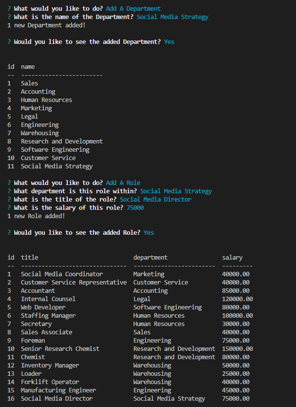
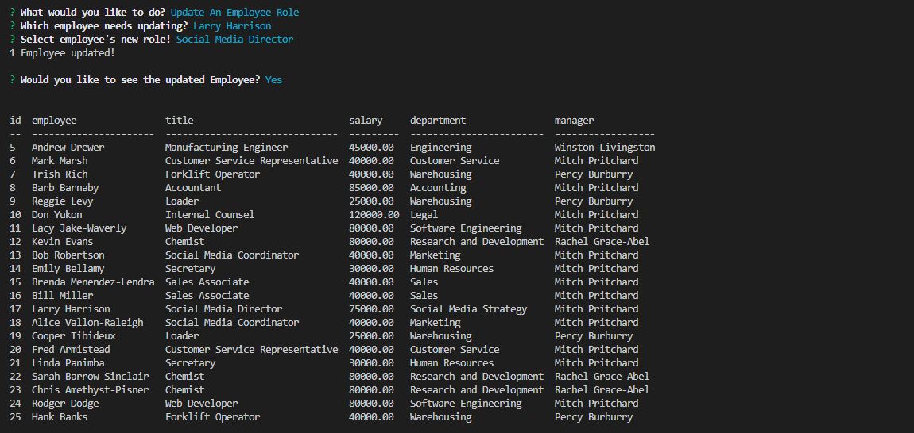
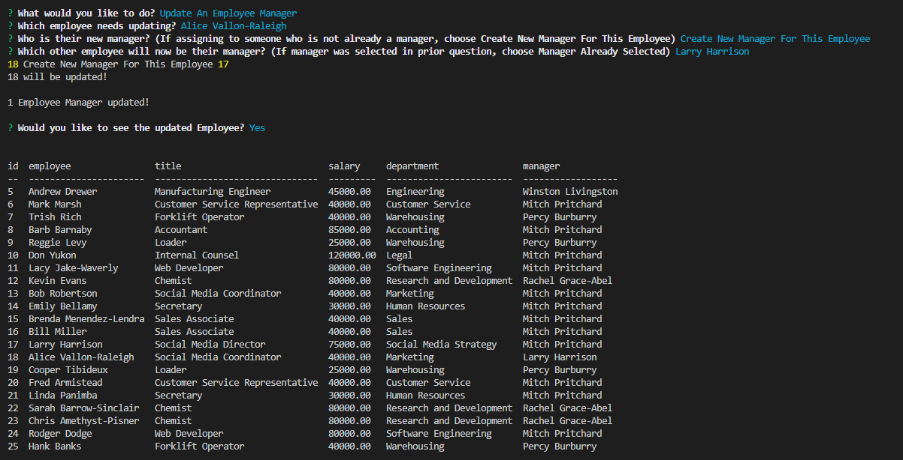
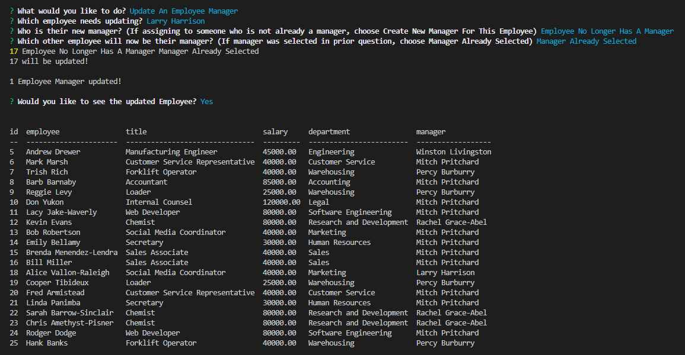
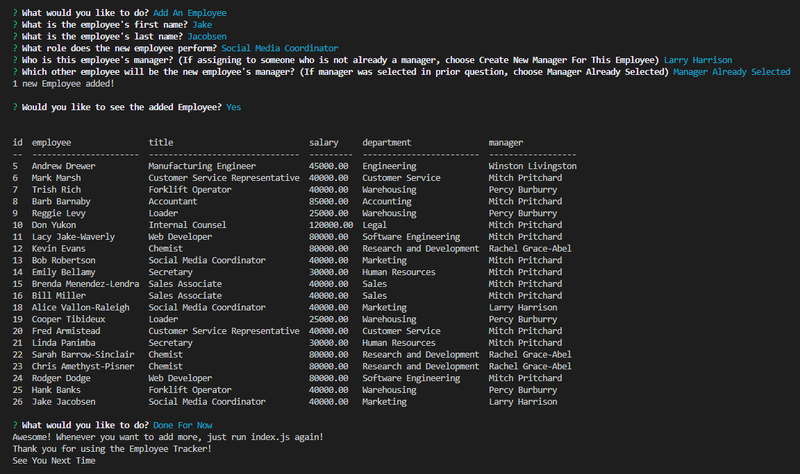

# MySQL Employee Tracker - John Mabie

[](https://opensource.org/licenses/MIT)
---
### This project is designed to allow a user to use and update a functional database for their business.

#### Here is the link to the GitHub repository: https://github.com/jmabie94/3-9-23-Employee-Tracker
---
## Contents
1. [About](#about)
    1. [User Story](#user%20story)
    2. [Acceptance Criteria](#acceptance%20criteria)
    3. [Media](#media)
2. [Installation](#installation)
3. [License](#license)
4. [Contributing](#contributing)
5. [Tests](#tests)
6. [Authors and Acknowledgments](#authors%20and%20acknowledgments)
---
## About

#### Using Node.js, Inquirer and MySQL, this terminal application allows a business owner to keep track of their departments, the roles within those departments, the employees who fill those roles, the managers who oversee those employees and the salaries each of them get paid! Better yet, the application is designed so that each employee can be updated and have their management adjusted as needed in order to keep track with promotions and changes of position or department, as needed.
---
## User Story

```md
AS A business owner
I WANT to be able to view and manage the departments, roles, and employees in my company
SO THAT I can organize and plan my business
```

## Acceptance Criteria

```md
GIVEN a command-line application that accepts user input
WHEN I start the application
THEN I am presented with the following options: view all departments, view all roles, view all employees, add a department, add a role, add an employee, and update an employee role
WHEN I choose to view all departments
THEN I am presented with a formatted table showing department names and department ids
WHEN I choose to view all roles
THEN I am presented with the job title, role id, the department that role belongs to, and the salary for that role
WHEN I choose to view all employees
THEN I am presented with a formatted table showing employee data, including employee ids, first names, last names, job titles, departments, salaries, and managers that the employees report to
WHEN I choose to add a department
THEN I am prompted to enter the name of the department and that department is added to the database
WHEN I choose to add a role
THEN I am prompted to enter the name, salary, and department for the role and that role is added to the database
WHEN I choose to add an employee
THEN I am prompted to enter the employee’s first name, last name, role, and manager, and that employee is added to the database
WHEN I choose to update an employee role
THEN I am prompted to select an employee to update and their new role and this information is updated in the database 
```
---

## Media:

Video Walkthrough of the Application and all functions:


Five-Step process of adding a new department, creating a new role for that department, switching a current employee to the new role, assigning current employees to them as a new manager, and adding new employees to be assigned to them as a new manager:







---

## Installation:

Utilizing the Application is simple!

First, clone the repo:
    
    git clone git@github.com:jmabie94/3-9-23-Employee-Tracker.git

Next, open an integrated terminal in your cloned folder and do the following:
    
    run npm init -y
    run npm i

After Node Packages have installed, open your MySQL:
    ```mb
    mysql -u root -p
    *enter your password*
    SOURCE db/schema.sql
    SOURCE db/seeds.sql (optional, if you'd like a simple example roster of employees to start with)
    exit
    ```

Finally, after exiting MySQL:

    run node index.js

Then, utilize the Inquirer Prompts in your terminal to freely customize your workforce database!
    
---

## License
License used for this project - MIT
* For more information on license types, please reference this website for additional licensing information - [https: //choosealicense.com/](https://choosealicense.com/).
---
## Contributing:
To contribute to this application, create a pull request.
Here are the steps needed for doing that:
- Fork the repo
- Create a feature branch (git checkout -b NAME-HERE)
- Commit your new feature (git commit -m 'Add some feature')
- Push your branch (git push)
- Create a new Pull Request
Following a code review, your feature will be merged.
---
## Tests:

### No tests were used
---
## Authors and Acknowledgments:

### Primary Author: Jack Mabie

### Resources Used: Node.js, Inquirer, MySQL, Console.Table, Tutoring, AskBCS, W3 Schools 
### Multiple Stack Exchange Forum Posts and Multiple Stack Overflow Forum Posts

---
## Contact Information:
* GitHub Username: jmabie94
* Email: johnmabie94@gmail.com

---
## Notes for Grading Team:
I still intend to add functionality so that you can search Budgets by Department, improve the View Employees functionality to also show Managers and not just employees with managers, add an update Department Role functionality so that if a new department is a better match for a role currently within another the role can be switched, as well as functionality to delete departments, roles and employees as necessary. This is the first assignment where I've been drastically late turning it in (as I found it noticeably more challenging than anything else presented so far during this bootcamp) so I'm submitting this now that I have all the base requirements working, and will update in coming weeks. 